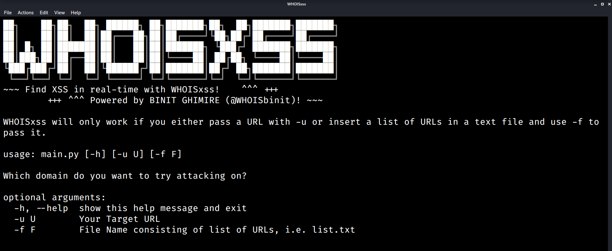
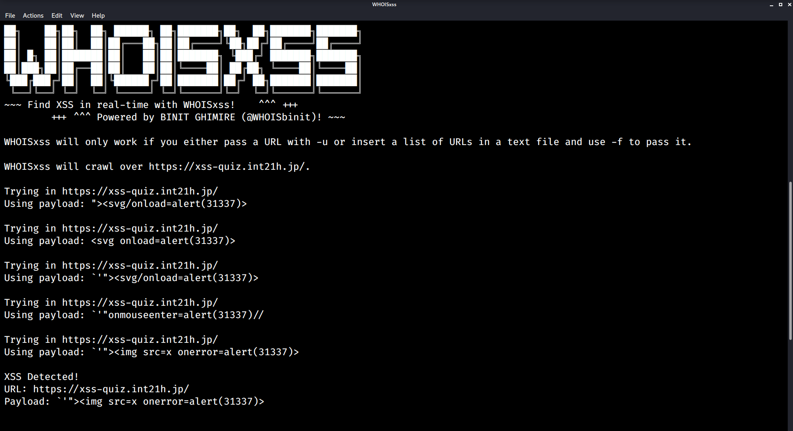

     
	<h1 style="font-size:36px;font-weight:bold;">
        WHOISxss 
        &nbsp;&nbsp;<strong>Powered by BINIT GHIMIRE (<a href='https://twitter.com/WHOISbinit'>@WHOISbinit</a>)</strong>
    </h1>
	
	<h3>Real-time <strong>XSS</strong> Detection Suite!</h3>

    Find XSS in Real-time with WHOISxss! 
    ~~~ ___***___~~~

## Requirements
1. **Python** (3.x)
2. **PIP** for **Python3**
3. **Required Modules:** **selenium**, **argparse**
    #### Install from **requirements.txt**
    > `pip3 install -r requirements.txt`
    #### Manual Installation
    > `pip3 install selenium argparse`

## Installation
1. Download/clone the repository to your local machine:
   
    `git clone https://github.com/TheBinitGhimire/WHOISxss`
2. Switch to the **WHOISxss** directory!

    `cd WHOISxss`

## Usage
There are two ways to make use of WHOISxss;

1. Single URL
2. Multiple URLs 
   
> ### Using WHOISxss for Single URL:
> `python3 main.py -u URL`  
> For example: 
> `python3 main.py -u https://xss-quiz.int21h.jp/`  

> ### Using WHOISxss for Multiple URLs:
> Create a text file with any name, with a list of URLs, separated by new lines. 
> `python3 main.py -f FILENAME`  
> For example: 
> `python3 main.py -f list.txt`  

## Feature Requests

If you are interested in contributing in the development of <strong>WHOISxss</strong>, you can feel free to create a <strong>Pull Request</strong> with modifications in the original code, or you shall open up a new <strong>issue</strong>, and I will try to include the feature as requested.

There is no restriction on anyone for contributing to the development of <strong>WHOISxss</strong>. If you would like to contribute, you can feel free to do so.

<strong>~~~ ___***___~~~</strong>
